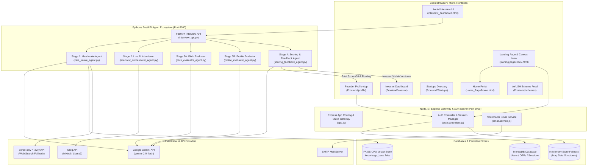

# PROJECT CONTEXT

## 1. PROJECT IDENTITY

- **Project Name:** Startup-AYUSH Portal (SIH 2026 | Problem Statement SIH1345)
- **Project Type:** Full-Stack AI-Powered Evaluation & Startup-Investor Ecosystem Portal
- **Problem:** AYUSH (Ayurveda, Yoga & Naturopathy, Unani, Siddha, Homeopathy) startups face significant challenges in securing funding, demonstrating market credibility, and gaining objective validation. Investors struggle to discover verified AYUSH ventures, while government ministries lack automated tools to screen pitch decks, evaluate founder competency, and route startups to appropriate funding schemes or mentorship programs.
- **Solution:** A unified platform featuring an automated 4-Agent LLM & RAG Pitch Evaluation Pipeline, a real-time interactive AI Interview Engine, a secure Express + MongoDB Authentication service with In-Memory fallback, and five specialized micro-frontends (Landing Page with canvas video animation, Main AYUSH Portal, Startups Directory, Investor Dashboard, Founder Profile Manager, and Government Scheme Feed).
- **Target Users:** AYUSH Startup Founders, Investors & VCs, AYUSH Incubators/Mentors, Ministry of AYUSH Administrators.
- **Main Goal:** Streamline startup intake via PDF/PPT pitch deck parsing, conduct adaptive live AI interviews, run multi-agent evaluation against competitor RAG vector indexes, normalize scores out of 30 with automated routing (`investor_visible` vs. `mentor_routed`), and facilitate investor matching and scheme discovery.
- **Current Development Status:** Functional Hackathon Prototype / MVP. Features an operational 4-Agent Python pipeline (FastAPI), Node.js/Express Auth server with dual DB mode (MongoDB + In-Memory), and 5 distinct frontend modules integrated under a master Express web server.

---

## 2. PROJECT STRUCTURE

```
SIH-hackthon-INTERNAL-/
├── package.json                   # Root package manager & master dev runner (concurrently)
├── PROJECT_CONTEXT.md             # Complete AI-Context Document (this file)
│
├── Agent/                         # Python AI Agent Ecosystem & FastAPI Server
│   ├── interview_api.py           # FastAPI backend serving live interview & evaluation endpoints
│   ├── pipeline_orchestrator.py   # Master 4-agent pipeline orchestrator script
│   ├── idea_intake_agent.py       # Stage 1: Multimodal pitch deck parser & RAG competitor checker
│   ├── interview_orchestrator_agent.py # Stage 2: Real-time adaptive AI interviewer (Groq/LLM)
│   ├── pitch_evaluator_agent.py   # Stage 3A: Pitch idea & strategy evaluator (Gemini)
│   ├── profile_evaluator_agent.py # Stage 3B: Founder & team profile evaluator (Gemini)
│   ├── scoring_feedback_agent.py # Stage 4: Score normalization (out of 30), routing & feedback generator
│   ├── seed_kb.py                 # Vector DB builder script (populates FAISS index)
│   ├── knowledge_base.faiss       # Local FAISS CPU vector index for competitor RAG lookups
│   ├── interview_dashboard.html   # Standalone web client interface for live AI interviews
│   ├── requirements.txt           # Python dependencies (google-genai, groq, faiss-cpu, fastapi, uvicorn)
│   └── .env                       # API keys for Gemini, Groq, Serper, Tavily
│
├── Authentication/                # Node.js + Express Authentication Service
│   ├── server.js                  # HTTP server entry point (Port 3000)
│   ├── package.json               # Backend dependencies (express, mongoose, jwt, bcrypt, nodemailer)
│   ├── .env                       # DB URI, JWT Secrets, SMTP Config
│   ├── public/                    # Static auth page assets & global styles
│   └── src/
│       ├── app.js                 # Express app setup, CORS, cookies, static route integration
│       ├── config/
│       │   ├── config.js          # Environment variable loader
│       │   └── database.js        # Mongoose MongoDB connection builder
│       ├── controllers/
│       │   └── auth.controllers.js # Auth handlers (register, login, verify OTP, refresh token, logout)
│       ├── models/
│       │   ├── user.model.js      # User Mongoose Schema (username, email, password, verified)
│       │   ├── otp.model.js       # OTP Verification Mongoose Schema
│       │   └── session.model.js   # User Session Mongoose Schema (refreshTokenHash, ip, userAgent)
│       ├── routes/
│       │   └── auth.routes.js     # Router mapping endpoints to auth.controllers.js
│       ├── service/
│       │   └── email.service.js   # Nodemailer transporter for email OTP delivery
│       └── utils/
│           └── utils.js           # OTP generator & HTML email template builder
│
└── Frontend/                      # Multi-Module Frontend System
    ├── package.json               # Sub-app development runner (concurrently + serve)
    ├── starting page/             # Root Landing Page & Intro Mandala Animation
    │   ├── index.html             # Main entry point served at http://localhost:3000/
    │   ├── script.js              # HTML5 Canvas 202-frame WebP mandala intro sequence animation
    │   ├── auth.js                # Frontend JS client for auth modal & JWT management
    │   ├── styles.css             # Landing page CSS
    │   └── landing_frames/        # 202 pre-rendered animation frames (.webp)
    ├── Home_Page/                 # Portal Homepage & Navigation Hub
    │   ├── home.html              # AYUSH Portal main overview page
    │   └── home.css               # Home page styling
    ├── Startups/                  # Vite + React Startups Discovery Directory
    │   ├── index.html
    │   ├── vite.config.js         # Vite configuration (Port 5173)
    │   └── src/
    │       ├── App.jsx            # Main App container & routing switcher
    │       ├── pages/             # Startups page view
    │       ├── components/        # 15+ rich UI components (Filters, Map, Comparison, AI Recommendations)
    │       └── data/              # Startup listing mock datasets
    ├── investor/                  # Vite + React Investor Dashboard
    │   ├── index.html
    │   └── InvestorDashboardPage.jsx # Comprehensive investor view (deal flow, analytics, shortlist)
    ├── profile/                   # Vite + React Founder Profile Management
    │   ├── index.html
    │   ├── vite.config.js         # Vite configuration (Port 5176)
    │   └── src/
    │       └── MyProfile.jsx      # Founder profile management UI (verification, metrics, pitch status)
    └── schemes/                   # Vite + React AYUSH Government Schemes Feed
        ├── index.html
        ├── vite.config.js         # Vite configuration (Port 5175)
        └── SchemeFeed.jsx         # Scheme discovery, eligibility checker & application tracker
```

---

## 3. TECH STACK

| Technology | Purpose | Where Used |
| :--- | :--- | :--- |
| **Node.js (v18+)** | Backend runtime environment | Express Auth server & static asset gateway |
| **Express (v5.2)** | Web application framework | `Authentication/src/app.js` & `server.js` |
| **MongoDB / Mongoose (v9.9)** | Primary Document Database & ODM | User credentials, sessions, and OTP persistent store |
| **Python (v3.10+)** | AI pipeline runtime environment | `Agent/` directory ecosystem |
| **FastAPI** | Async web framework for AI APIs | `Agent/interview_api.py` |
| **Uvicorn** | ASGI server for FastAPI | Serving AI interview endpoints on Port 8000 |
| **Google Gemini API** | Multimodal deck analysis & evaluation LLM | `idea_intake_agent.py`, `pitch_evaluator_agent.py`, `profile_evaluator_agent.py`, `scoring_feedback_agent.py` |
| **Groq API** | Low-latency LLM for real-time live interview QA | `interview_orchestrator_agent.py` |
| **FAISS CPU** | High-performance vector similarity search | `Agent/knowledge_base.faiss` for competitor RAG lookups |
| **Numpy & PyPDF2** | Numerical array handling & PDF parsing | `Agent/seed_kb.py`, `idea_intake_agent.py` |
| **React (v18.3)** | UI Library for modular frontend applications | `Frontend/Startups`, `Frontend/profile`, `Frontend/schemes`, `Frontend/investor` |
| **Vite (v5.4)** | Next-gen frontend tooling and dev server | Sub-applications building & HMR serving |
| **Tailwind CSS (v3.4)** | Utility-first CSS framework | Styling in Vite + React sub-apps |
| **HTML5 Canvas / Vanilla JS** | Smooth 24fps frame sequence renderer | `Frontend/starting page/script.js` intro animation |
| **JWT (JsonWebToken)** | Stateless authentication tokens | `auth.controllers.js` (15m Access Token) |
| **Cookie-Parser / Bcrypt** | HTTP-only cookie management & password hashing | `Authentication` middleware & controllers |
| **Nodemailer** | SMTP email client | `email.service.js` for 6-digit OTP delivery |
| **Concurrently** | Parallel execution of multi-process servers | Root `package.json` and `Frontend/package.json` |

---

## 4. USER ROLES

### Role 1: Startup Founder / Entrepreneur
- **Purpose:** Create an account, upload pitch deck, take live AI interview, track evaluation scores, receive AI feedback report, manage company profile, apply to government schemes.
- **Access:** Registered & OTP-Verified User.
- **Important Pages:** `/auth`, `/profile` (`MyProfile.jsx`), `/schemes` (`SchemeFeed.jsx`), `interview_dashboard.html`.

### Role 2: Investor / Venture Capitalist
- **Purpose:** Browse evaluated startups, review AI pitch deck scores, inspect founder risk metrics, shortlist ventures, request connection.
- **Access:** Public or Authenticated Investor view.
- **Important Pages:** `/investor` (`InvestorDashboardPage.jsx`), `/startups` (`Startups.jsx`).

### Role 3: Mentor / Incubator Evaluator
- **Purpose:** Review startups that scored below `investor_visible` threshold (`mentor_routed`), view detailed gap analysis notes, provide guidance.
- **Access:** Evaluator / Admin role (Conceptual).
- **Important Pages:** `/investor` (filtered by mentor routing), evaluation raw output payloads.

### Role 4: Public / Guest User
- **Purpose:** Experience the interactive AYUSH intro mandala animation, explore public AYUSH startup directory, view available government schemes.
- **Access:** Unauthenticated.
- **Important Pages:** `/` (`Frontend/starting page/index.html`), `/Home_Page/home.html`, `/schemes`, `/startups`.

---

## 5. COMPLETE FEATURE MAP

```
[User Registration & OTP] ──> [Express Auth API] ──> [MongoDB / In-Memory Fallback] ──> [Email OTP via Nodemailer]
                                                                                            │
[Founder Pitch Upload] ────> [FastAPI /upload] ───> [Idea Intake Agent (Gemini + RAG)] ─────┤
                                                                                            ▼
[Live AI Interview] ──────> [Interview Agent] ────> [Groq LLM Adaptive QA] ─────────> [Split Transcripts]
                                                                                            │
[Multi-Agent Pipeline] ───> [Pitch Evaluator] ───> [Profile Evaluator] ───────────> [Scoring & Feedback]
                                                                                            │
                                                                                            ▼
[Scored Output & Routing] ─> [Total Score / 30] ─> [Investor Visible OR Mentor Routed] ──> [Investor Dashboard / Profile]
```

| Feature | Purpose | User | Frontend | Backend | Database | External Service | Connected Features |
| :--- | :--- | :--- | :--- | :--- | :--- | :--- | :--- |
| **Authentication & Session** | User Signup, Login, Password Hashing, JWT cookie sessions | All | `starting page/auth.js`, `/auth` | Express (`/api/auth`) | MongoDB / In-Mem fallback | Nodemailer | User Profile, Protected Routes |
| **OTP Verification** | Email ownership validation via 6-digit hash | Founder / Investor | `auth.js` (OTP Modal) | Express (`/api/auth/verify-email`) | MongoDB / In-Mem | Nodemailer SMTP | User Registration |
| **Mandala Intro Animation** | 202-frame 24fps canvas animation with fade-to-white handoff | Public | `starting page/script.js` | Express Static Gateway | None | None | Home Page Reveal |
| **Pitch Deck Upload (Stage 1)** | Upload PDF/PPT pitch deck, extract structured JSON & RAG competitor check | Founder | `interview_dashboard.html` | FastAPI (`/api/idea/upload`) | FAISS Index (`knowledge_base.faiss`) | Gemini 2.0 Flash, Serper/Tavily | Live AI Interview, Pitch Evaluation |
| **Live AI Interview (Stage 2)** | Real-time adaptive Q&A driven by founder pitch deck context | Founder | `interview_dashboard.html` | FastAPI (`/api/interview/*`) | In-Memory `_SESSIONS` | Groq LLM (Mixtral/Llama3) | Pitch & Profile Evaluator Agents |
| **Pitch Evaluator Agent (Stage 3A)** | Score pitch idea, market, business model, traction & gap coverage | System | FastAPI (`/api/interview/evaluate`) | `pitch_evaluator_agent.py` | None | Gemini 2.0 Flash | Scoring & Feedback Agent |
| **Profile Evaluator Agent (Stage 3B)**| Score founder experience, team completeness & credibility | System | FastAPI (`/api/interview/evaluate`) | `profile_evaluator_agent.py` | None | Gemini 2.0 Flash | Scoring & Feedback Agent |
| **Scoring & Feedback (Stage 4)** | Normalize scores to /30, determine routing, write LLM feedback | System | FastAPI (`/api/interview/evaluate`) | `scoring_feedback_agent.py` | None | Gemini 2.0 Flash | Founder Profile, Investor Dashboard |
| **Startups Directory** | Filterable grid, AI recommendations, comparison, map view | All | `Startups/src/App.jsx` | Vite Static / Express Static | Mock JSON | None | Investor Dashboard, Profile |
| **Investor Dashboard** | Deal flow, startup metrics, pitch scores, shortlist management | Investor | `investor/InvestorDashboardPage.jsx` | Vite Static / Express Static | LocalStorage / Mock | None | Startups Directory, Evaluation Pipeline |
| **Founder Profile** | Founder details, verification status, pitch score summary | Founder | `profile/src/MyProfile.jsx` | Vite Static / Express Static | LocalStorage / Auth API | None | Authentication, Pitch Upload |
| **AYUSH Scheme Feed** | Discover Ministry schemes, filter by stage/category, check eligibility | Founder | `schemes/SchemeFeed.jsx` | Vite Static / Express Static | Mock JSON | None | Founder Profile |

---

## 6. FEATURE CONNECTIONS

```
Authentication System (Express + MongoDB / Memory)
       │
       ▼
User Profile Context (`ayush_user_profile` in LocalStorage / JWT Token)
       │
       ├────────────────────────────────────────┐
       ▼                                        ▼
Founder Workflow                        Investor Workflow
       │                                        │
  1. Profile Management (`/profile`)       1. Browse Directory (`/startups`)
       │                                        │
  2. Pitch Deck Intake (`/api/idea/upload`) 2. View Deal Flow (`/investor`)
       │                                        │
  3. Live AI Interview (`/api/interview/*`) 3. Inspect AI Scores (/30) & Feedback
       │                                        │
  4. 4-Agent Evaluation Pipeline            4. Shortlist / Connect with Founder
       │
  5. Score Normalization & Routing
       ├───────────────────────────────┐
       ▼                               ▼
[Score ≥ Threshold]            [Score < Threshold]
  `investor_visible`              `mentor_routed`
       │                               │
       ▼                               ▼
Visible on Investor Dashboard    Routed to AYUSH Incubator / Mentors
```

---

## 7. USER JOURNEYS

### Journey 1: Public Visitor
`Landing Mandala Intro` (`/`) ➔ `Fade to White` ➔ `Main Home Portal` (`/Home_Page/home.html`) ➔ `Explore Startups Directory` (`/startups`) OR `Browse AYUSH Government Schemes` (`/schemes`).

### Journey 2: Founder (Pitch Evaluation & Funding Journey)
`Click Login/Register` ➔ `Fill Registration Form` ➔ `Receive 6-digit OTP via Email` ➔ `Verify OTP` ➔ `Redirected to Profile` (`/profile`) ➔ `Launch AI Interview Dashboard` (`interview_dashboard.html`) ➔ `Upload Pitch Deck (PDF/PPT)` ➔ `Stage 1 Intake Processing` ➔ `Complete 5-Question Adaptive AI Interview` ➔ `Trigger Stage 3 & 4 Evaluation Pipeline` ➔ `View Final Score /30 & AI Feedback Report` ➔ `Matched with AYUSH Schemes` (`/schemes`).

### Journey 3: Investor (Deal Discovery Journey)
`Open Investor Dashboard` (`/investor`) ➔ `Filter Startups by Category / Stage / Score` ➔ `Review AI Evaluation Breakdown (Pitch /19.5, Profile /10.5)` ➔ `Check Competitor & Gap Analysis Notes` ➔ `Shortlist Startup` ➔ `Initiate Direct Founder Contact`.

---

## 8. APPLICATION ROUTES

| Route Path | Page / App Component | Access Level | Purpose |
| :--- | :--- | :--- | :--- |
| `/` | `Frontend/starting page/index.html` | Public | Main landing page featuring Mandala Canvas animation & portal intro |
| `/Home_Page` | `Frontend/Home_Page/home.html` | Public | Core overview dashboard & navigation hub |
| `/auth` | `Authentication/public/index.html` | Public | Standalone Login / Register UI page |
| `/profile` | `Frontend/profile/dist/index.html` (`MyProfile.jsx`) | Authenticated | Founder profile management, metrics, & pitch readiness |
| `/startups` | `Frontend/Startups/dist/index.html` (`Startups.jsx`) | Public | Interactive AYUSH startup directory, search & comparison |
| `/investor` | `Frontend/investor/InvestorDashboardPage.jsx` | Public / Investor | Investor deal-flow portal, risk metrics & pitch scorecard |
| `/schemes` | `Frontend/schemes/dist/index.html` (`SchemeFeed.jsx`) | Public | Ministry of AYUSH government schemes & eligibility engine |
| `/api/auth/*` | Express Auth Router | API | Endpoints for authentication, OTP, JWT, & sessions |
| `/api/interview/*` | FastAPI Agent Server (Port 8000) | API | Endpoints for deck upload, AI interview, and 4-agent scoring |

---

## 9. FRONTEND ARCHITECTURE

The frontend is structured as a **hybrid multi-app portal**:
1. **Landing & Gateway (`Frontend/starting page`)**:
   - Built with raw HTML5, CSS3, and high-performance Vanilla JavaScript.
   - Uses HTML5 Canvas 2D context to render a 202-frame `.webp` sequence (`script.js`) with cubic-bezier easing to transition into a warm off-white handoff color (`#F7F4EE`).
   - Integrated with `auth.js` for handling modal login/register dialogs, JWT local storage caching, and calling Express Auth endpoints.
2. **Modular Sub-Applications (Vite + React 18 + Tailwind CSS)**:
   - **Startups App (`Frontend/Startups`)**: Complete directory with 15+ sub-components including `StartupCard`, `StartupGrid`, `StartupComparison`, `AIRecommendations`, `Filters`, `Map`, and `Statistics`.
   - **Investor App (`Frontend/investor`)**: Heavy dashboard component (`InvestorDashboardPage.jsx`) managing local state for search, sector filters, deal stages, and founder profile cards.
   - **Profile App (`Frontend/profile`)**: Founder profile workspace (`MyProfile.jsx`) with dynamic verification tabs, pitch upload status, and company metrics.
   - **Schemes App (`Frontend/schemes`)**: Government schemes directory (`SchemeFeed.jsx`) with real-time filtering, eligibility tags, and application workflow status.
3. **Master Express Integration**:
   - In production/integrated dev mode (`Authentication/src/app.js`), Express serves compiled static dist assets from each frontend directory under distinct route prefixes (`/startups`, `/profile`, `/schemes`, `/Home_Page`).

---

## 10. BACKEND ARCHITECTURE

The system features a **dual-service micro-backend**:

```
                                  ┌─────────────────────────────────────────┐
                                  │      Client (Browser / Sub-apps)        │
                                  └────────────────────┬────────────────────┘
                                                       │
                           ┌───────────────────────────┴───────────────────────────┐
                           │                                                       │
                           ▼                                                       ▼
            ┌─────────────────────────────┐                         ┌─────────────────────────────┐
            │   Node.js / Express Auth    │                         │    Python / FastAPI Agent   │
            │        (Port 3000)          │                         │         (Port 8000)         │
            └──────────────┬──────────────┘                         └──────────────┬──────────────┘
                           │                                                       │
              ┌────────────┴────────────┐                             ┌────────────┴────────────┐
              ▼                         ▼                             ▼                         ▼
      ┌──────────────┐          ┌──────────────┐              ┌──────────────┐          ┌──────────────┐
      │  MongoDB /   │          │  Nodemailer  │              │ Google Gemini│          │   Groq LLM   │
      │   Mongoose   │          │ (Email OTP)  │              │ (Agents 1,3,4)│          │  (Agent 2)   │
      └──────────────┘          └──────────────┘              └──────────────┘          └──────────────┘
                                                                      │
                                                                      ▼
                                                              ┌──────────────┐
                                                              │  FAISS Vector│
                                                              │  Index (RAG) │
                                                              └──────────────┘
```

### 1. Authentication Service (Node.js + Express)
- **Entry Point:** `Authentication/server.js` ➔ `Authentication/src/app.js`
- **Database Logic:** Supports dual-mode operation (`auth.controllers.js`):
  - **Online Mode:** MongoDB via Mongoose (`userModel`, `otpModel`, `sessionModel`).
  - **Offline Fallback Mode:** In-memory ES6 Maps (`inMemUsers`, `inMemOtps`, `inMemSessions`) automatically engaged if MongoDB is disconnected.

#### Primary Auth Endpoints:
- `POST /api/auth/register`: Create user account, hash password with bcrypt (10 rounds), generate 6-digit OTP, send email via Nodemailer.
- `POST /api/auth/verify-email`: Validate 6-digit OTP hash against DB/Memory, set `verified: true`.
- `POST /api/auth/login`: Validate credentials, generate JWT Access Token (15m expiration) & HTTP-only Refresh Cookie (3d expiration), store hashed session.
- `GET /api/auth/get-me`: Return authenticated user details from Bearer token.
- `GET /api/auth/refresh-token`: Rotate refresh token cookie and issue new 15m access token.
- `GET /api/auth/logout`: Revoke active session and clear cookies.
- `GET /api/auth/logout-all`: Invalidate all active sessions for the user.

### 2. AI Evaluation Service (Python + FastAPI)
- **Entry Point:** `Agent/interview_api.py` (running via Uvicorn on Port 8000)
- **Pipeline Orchestration:** `pipeline_orchestrator.py`

#### Primary Agent Endpoints:
- `POST /api/idea/upload`: Accept pitch deck PDF/PPT upload, invoke `idea_intake_agent.py` to extract structured intake JSON and run FAISS competitor check.
- `POST /api/interview/start`: Initialize an `InterviewSession`, return first adaptive question generated by `interview_orchestrator_agent.py` (Groq API).
- `POST /api/interview/answer`: Submit founder answer, return next question or completion state.
- `GET /api/interview/result/{session_id}`: Retrieve split transcripts (`transcript_idea_qa` and `transcript_profile_qa`).
- `POST /api/interview/evaluate/{session_id}`: Execute `pitch_evaluator_agent.py`, `profile_evaluator_agent.py`, and `scoring_feedback_agent.py` on session transcripts.
- `GET /api/health`: Health status & active session counts.

---

## 11. DATABASE / DATA MODEL

### 1. MongoDB Collections (Mongoose Schemas)

#### User Collection (`users`)
```js
{
  username: { type: String, required: true, unique: true },
  email:    { type: String, required: true, unique: true },
  password: { type: String, required: true }, // Bcrypt hashed
  verified: { type: Boolean, default: false }
}
```

#### OTP Collection (`otps`)
```js
{
  email:     { type: String, required: true },
  user:      { type: Schema.Types.ObjectId, ref: "users", required: true },
  otpHash:   { type: String, required: true }, // SHA-256 hashed 6-digit PIN
  createdAt: { type: Date, expires: '10m' }
}
```

#### Session Collection (`sessions`)
```js
{
  user:             { type: Schema.Types.ObjectId, ref: "users", required: true },
  refreshTokenHash: { type: String, required: true }, // SHA-256 hashed JWT
  ip:               { type: String, required: true },
  userAgent:        { type: String, required: true },
  revoked:          { type: Boolean, default: false },
  createdAt:        { type: Date }
}
```

### 2. FAISS Vector Database (`Agent/knowledge_base.faiss`)
- **Format:** FAISS IndexFlatL2 CPU vector store paired with `knowledge_base.faiss.meta.json`.
- **Purpose:** Stores pre-indexed AYUSH industry market data and competitor profiles for Stage 1 RAG similarity lookups.

---

## 12. AUTHENTICATION & SECURITY ARCHITECTURE

- **Password Security:** Salted and hashed using `bcrypt` (cost factor 10). Passwords are never stored or logged in plain text.
- **Two-Factor OTP Verification:** 6-digit numeric OTP generated via cryptographically secure logic, stored as a SHA-256 hash (`crypto.createHash('sha256')`), delivered via SMTP using Nodemailer.
- **Token Strategy:**
  - **Access Token:** Short-lived JWT (15 minutes) signed with `JWT_SECRET`, returned in JSON payload, passed via `Authorization: Bearer <token>` headers.
  - **Refresh Token:** Long-lived JWT (3 days) stored in HTTP-Only, `SameSite=Strict`, `Secure` browser cookie.
- **Session Tracking:** Refresh tokens are hashed before storing in DB/Memory, preventing token leakage from database compromises. Supports single-device logout and multi-device revocation (`logout-all`).
- **Resilient Fallback:** `auth.controllers.js` actively monitors MongoDB state via `mongoose.connection.readyState`. If MongoDB is unavailable, it gracefully degrades to isolated, in-memory Map structures without throwing unhandled exceptions.

---

## 13. API + DATA FLOW

### Detailed Workflow: Founder Pitch Evaluation Sequence

```
1. Founder uploads PDF deck on interview UI
   │
   ▼
2. POST /api/idea/upload ──> FastAPI saves temp PDF file
   │
   ▼
3. Stage 1: idea_intake_agent.py ──> Calls Gemini 2.0 Multimodal API
   │                                └── Extracts structured JSON (problem, solution, team, ask)
   │                                └── Queries local FAISS vector DB (knowledge_base.faiss)
   │                                └── (Fallback) Performs live web search via Serper/Tavily
   ▼
4. Response returns structured `intake_json` to frontend
   │
   ▼
5. Founder clicks "Start Live Interview" ──> POST /api/interview/start
   │
   ▼
6. Stage 2: interview_orchestrator_agent.py ──> Instantiates InterviewSession
   │                                           └── Calls Groq API (Mixtral/Llama3)
   │                                           └── Generates 5 adaptive questions based on intake_json
   ▼
7. Founder answers questions turn-by-turn ──> POST /api/interview/answer
   │                                         └── Session tags Q&A categories ("team" vs "idea")
   │                                         └── Constructs separate `transcript_idea_qa` & `transcript_profile_qa`
   ▼
8. Interview completed ──> POST /api/interview/evaluate/{session_id}
   │
   ├──> Stage 3A: pitch_evaluator_agent.py (Gemini 2.0)
   │    └── Scores idea, market, business model, traction, gap coverage (raw /50)
   │
   ├──> Stage 3B: profile_evaluator_agent.py (Gemini 2.0)
   │    └── Scores founder experience, team completeness, credibility (raw /40)
   │
   └──> Stage 4: scoring_feedback_agent.py
        └── Normalizes Pitch score: (pitch_subtotal / 50) * 19.5
        └── Normalizes Profile score: (profile_subtotal / 40) * 10.5
        └── Total Score = Pitch + Profile (out of 30.0)
        └── Determines Routing:
              • Score ≥ 18.0 ➔ `investor_visible`
              • Score < 18.0 ➔ `mentor_routed`
        └── Generates LLM feedback narrative (strengths, areas to improve, summary)
   │
   ▼
9. Final Scored Payload returned to UI ──> Rendered on Founder Profile & Investor Dashboard
```

---

## 14. AI INTEGRATION

### 1. Multi-Agent Ecosystem Overview

```
 ┌────────────────────────────────────────────────────────────────────────┐
 │                      AI AGENT PIPELINE ECOSYSTEM                       │
 ├────────────────────────────────────────────────────────────────────────┤
 │                                                                        │
 │  1. Idea Intake Agent (Gemini 2.0 Flash + FAISS RAG + Serper/Tavily)   │
 │     • Input: PDF / PPT Pitch Deck                                      │
 │     • Output: Structured intake JSON + competitor analysis             │
 │                                                                        │
 │  2. Interview Orchestrator Agent (Groq / Mixtral-8x7b / Llama3)        │
 │     • Input: Structured intake JSON + live user responses              │
 │     • Output: Real-time adaptive questions + dual split transcripts    │
 │                                                                        │
 │  3A. Pitch Evaluator Agent (Gemini 2.0 Flash)                          │
 │      • Input: Idea Q&A transcript + intake JSON                        │
 │      • Output: 5-parameter pitch scores (1-10 each) + gap notes        │
 │                                                                        │
 │  3B. Profile Evaluator Agent (Gemini 2.0 Flash)                        │
 │      • Input: Team Q&A transcript + intake JSON                        │
 │      • Output: 4-parameter founder scores (1-10 each) + team gap notes │
 │                                                                        │
 │  4. Scoring & Feedback Agent (Gemini 2.0 Flash + Python Math)          │
 │     • Input: Pitch score JSON + Profile score JSON                     │
 │     • Output: Total score /30, routing decision, synthesized report    │
 └────────────────────────────────────────────────────────────────────────┘
```

### 2. Detailed Agent Specifications

- **Idea Intake Agent (`idea_intake_agent.py`):**
  - **SDK:** `google-genai` package.
  - **Model:** `gemini-2.0-flash`.
  - **Prompting:** Structured JSON prompt extracting 12 canonical fields (`problem`, `solution`, `target_market`, `revenue_model`, `traction`, `team`, `differentiation`, `ask`, `missing_or_vague_fields`, `raw_summary`, `similar_existing_products`, `market_check_status`).
  - **RAG & Search Pipeline:** Uses `faiss-cpu` vector search against `knowledge_base.faiss`. If similarity score is below threshold, invokes `Tavily` or `Serper.dev` live web search APIs to discover external competitors.

- **Interview Orchestrator Agent (`interview_orchestrator_agent.py`):**
  - **SDK:** `groq` Python SDK.
  - **Model:** `mixtral-8x7b-32768` or `llama3-70b-8192`.
  - **Prompting:** Dynamic persona prompt acting as an experienced AYUSH Venture Capital investor. Formulates 5 concise, targeted questions focused on clarifying vague deck fields, market sizing, and founder commitment.

- **Pitch Evaluator Agent (`pitch_evaluator_agent.py`):**
  - **SDK:** `google-genai` / `google-generativeai`.
  - **Model:** `gemini-2.0-flash`.
  - **Scoring Math:** Evaluates 5 parameters (1-10 scale): Problem Clarity, Solution Feasibility, Market Opportunity, Business Model, Traction & Ask.

- **Profile Evaluator Agent (`profile_evaluator_agent.py`):**
  - **SDK:** `google-genai` / `google-generativeai`.
  - **Model:** `gemini-2.0-flash`.
  - **Scoring Math:** Evaluates 4 parameters (1-10 scale): Domain Expertise, Technical Capability, Execution Track Record, Team Completeness.

- **Scoring & Feedback Agent (`scoring_feedback_agent.py`):**
  - **SDK:** `google-genai` (for text feedback generation) + Python Math (for score calculation).
  - **Mathematical Normalization:**
    $$\text{Pitch Component} = \left(\frac{\text{Pitch Raw Subtotal}}{50}\right) \times 19.5$$
    $$\text{Profile Component} = \left(\frac{\text{Profile Raw Subtotal}}{40}\right) \times 10.5$$
    $$\text{Total Score} = \text{Pitch Component} + \text{Profile Component} \quad (\text{Max } 30.0)$$
  - **Routing Threshold:**
    - If $\text{Total Score} \ge 18.0 \implies \text{Routing} = \text{"investor\_visible"}$
    - If $\text{Total Score} < 18.0 \implies \text{Routing} = \text{"mentor\_routed"}$

---

## 15. EXTERNAL SERVICES & DEPENDENCIES

| Service | Purpose | Used By | Data Sent | Data Received | Failure Impact |
| :--- | :--- | :--- | :--- | :--- | :--- |
| **Google Gemini API** | Multimodal pitch deck parsing & evaluation | Agents 1, 3A, 3B, 4 | PDF/PPT files, Q&A transcripts | Structured JSON scores & feedback reports | Evaluation pipeline fails; fallback to mock error payload |
| **Groq API** | Ultra-fast LLM question generation | Agent 2 (`interview_orchestrator`) | Founder pitch summary, previous Q&As | Single targeted interview question | Interview falls back to static pre-defined questions |
| **Serper / Tavily API** | Web search for competitor research | Agent 1 (`idea_intake_agent`) | Search query (Startup concept keywords) | Top 5 web search result snippets | RAG falls back exclusively to local FAISS index |
| **Nodemailer / SMTP** | OTP verification email delivery | Auth Service (`email.service.js`) | Recipient email, 6-digit OTP code | SMTP delivery status message | User receives OTP code directly in API response payload (dev mode) |

---

## 16. SECURITY MECHANISMS

- **Credential Hashing:** Passwords hashed with `bcrypt` before database write operations.
- **OTP Protection:** OTPs are hashed using SHA-256 and stored with 10-minute expiration timestamps.
- **Session Protection:** Refresh tokens are stored in HTTP-Only cookies with `SameSite=Strict`. Hashed tokens in the database prevent session hijacking even if the database is leaked.
- **Protected API Endpoints:** Express `/api/auth/get-me` and FastAPI `/api/interview/*` endpoints enforce bearer token validation and session ID verification.
- **Sanitized Headers:** CORS middleware configured in both Express (`cors()`) and FastAPI (`CORSMiddleware`).
- **Zero-Exposure Env Vars:** Sensitive keys (`GEMINI_API_KEY`, `GROQ_API_KEY`, `JWT_SECRET`, `MONGO_URI`) isolated in `.env` files and excluded via `.gitignore`.

---

## 17. SCALABILITY CONTEXT

- **Current Scalability:**
  - **Frontend:** Highly scalable static assets; React sub-apps can be deployed to CDNs (Cloudflare Pages, Vercel, Netlify).
  - **Auth Backend:** Express server is stateless regarding access tokens. Scale horizontally behind a load balancer (Nginx).
  - **Agent Server:** Single-process FastAPI app using in-memory dictionary (`_SESSIONS`) for active interview state.
- **Potential Bottlenecks:**
  - In-memory session store (`_SESSIONS`) in `interview_api.py` limits multi-instance horizontal scaling for the AI agent backend.
  - Rate limits on third-party LLM APIs (Google Gemini and Groq free tiers) during concurrent user spikes.
  - Local FAISS CPU index reads from disk; requires loading into shared memory or migrating to a managed vector DB for scale.
- **Future Scaling Path:**
  - Replace in-memory `_SESSIONS` dictionary with a Redis cache cluster.
  - Migrate FAISS CPU index to Qdrant or Pinecone vector DB.
  - Implement message queue (Celery / RabbitMQ) for asynchronous multi-agent evaluation background jobs.

---

## 18. RELIABILITY & ERROR HANDLING

- **Database Offline Resilience:** `auth.controllers.js` features an active connection checker (`isDbConnected()`). If MongoDB drops, requests automatically execute against `inMemUsers`, `inMemOtps`, and `inMemSessions`, ensuring zero downtime during hackathon judging demos.
- **LLM Agent Robustness:**
  - `pipeline_orchestrator.py` wraps each stage in `try...except` blocks. If any agent stage fails, partial execution outputs (`intake_json`, `pitch_score_json`) are retained in the return object rather than throwing an unhandled exception.
  - Dotenv loading in agent scripts uses `load_dotenv(pathlib.Path(__file__).parent / ".env", override=True)` to guarantee key resolution regardless of process working directory.
- **File Upload Validation:** `interview_api.py` validates file extensions (`.pdf`, `.ppt`, `.pptx`), manages temporary filesystem storage safely, and enforces file cleanup in `finally` blocks.

---

## 19. PERFORMANCE OPTIMIZATION

- **202-Frame Canvas Animation:** Preloads WebP images asynchronously into memory before fading out the loader overlay. Uses `requestAnimationFrame` with cross-frame alpha blending to maintain smooth 24fps visual fidelity across screen refresh rates.
- **Groq Engine for Live Interview:** Selected Groq API for Stage 2 to achieve sub-500ms TTFT (Time To First Token) for real-time live question generation.
- **Vite Build System:** Fast hot-module replacement (HMR) and optimized rollup production bundles for React sub-apps.
- **Local Vector Indexing:** FAISS CPU index delivers sub-10ms vector similarity lookup latency without external network hops.

---

## 20. CURRENT LIMITATIONS

| Limitation | Impact | Possible Future Solution |
| :--- | :--- | :--- |
| **In-Memory Agent Sessions** | Active live interview states are stored in Python memory (`_SESSIONS`). Server restart loses active interview sessions. | Store session states in Redis or MongoDB. |
| **Dual SDK Dependencies** | `idea_intake_agent.py` uses `google-genai`, while older evaluators use `google-generativeai`. | Standardize all Python agent scripts on the unified `google-genai` SDK. |
| **Mock Datasets in Directory** | Startups and Schemes sub-apps currently rely on static mock JSON datasets alongside API connections. | Connect all sub-frontend directories to live MongoDB aggregation endpoints. |
| **File System Storage for Uploads** | Pitch deck files are temporarily saved to local `/tmp` disk storage during parsing. | Stream uploads directly to S3 / Google Cloud Storage buckets. |

---

## 21. IMPLEMENTATION STATUS

- `[IMPLEMENTED]` Express Authentication Service (Register, Login, Password Hashing, JWT, Cookies).
- `[IMPLEMENTED]` Email OTP Verification with Nodemailer.
- `[IMPLEMENTED]` In-Memory Offline DB Fallback Engine.
- `[IMPLEMENTED]` Stage 1 Idea Intake Agent (Multimodal Deck Parsing + Gemini 2.0).
- `[IMPLEMENTED]` Local FAISS CPU Vector Index & RAG Competitor Checker.
- `[IMPLEMENTED]` Stage 2 Live AI Interview Orchestrator (Groq LLM).
- `[IMPLEMENTED]` Stage 3A Pitch Evaluator Agent.
- `[IMPLEMENTED]` Stage 3B Profile Evaluator Agent.
- `[IMPLEMENTED]` Stage 4 Scoring & Feedback Agent (Normalized math out of 30 + routing logic).
- `[IMPLEMENTED]` FastAPI Server & Live Interview Web Dashboard (`interview_api.py` + `interview_dashboard.html`).
- `[IMPLEMENTED]` Landing Canvas 202-Frame WebP Mandala Intro Animation with Fade-to-White handoff.
- `[IMPLEMENTED]` Startups React Sub-Application (`Frontend/Startups`).
- `[IMPLEMENTED]` Investor Dashboard React Sub-Application (`Frontend/investor`).
- `[IMPLEMENTED]` Founder Profile Management React Sub-Application (`Frontend/profile`).
- `[IMPLEMENTED]` AYUSH Schemes Feed React Sub-Application (`Frontend/schemes`).
- `[PARTIAL]` Live DB persistence for evaluation results (currently returned in API responses and cached in LocalStorage).
- `[PLANNED]` Redis-backed multi-tenant session storage and Celery async workers.

---

## 22. IMPORTANT FILE MAP

| Feature / Area | Primary Files & File Paths |
| :--- | :--- |
| **Master Orchestration & Gateway** | [package.json](file:///c:/Users/anura/OneDrive/Desktop/SIH/SIH-hackthon-INTERNAL-/package.json), [Authentication/src/app.js](file:///c:/Users/anura/OneDrive/Desktop/SIH/SIH-hackthon-INTERNAL-/Authentication/src/app.js), [Authentication/server.js](file:///c:/Users/anura/OneDrive/Desktop/SIH/SIH-hackthon-INTERNAL-/Authentication/server.js) |
| **Authentication System** | [auth.controllers.js](file:///c:/Users/anura/OneDrive/Desktop/SIH/SIH-hackthon-INTERNAL-/Authentication/src/controllers/auth.controllers.js), [auth.routes.js](file:///c:/Users/anura/OneDrive/Desktop/SIH/SIH-hackthon-INTERNAL-/Authentication/src/routes/auth.routes.js), [user.model.js](file:///c:/Users/anura/OneDrive/Desktop/SIH/SIH-hackthon-INTERNAL-/Authentication/src/models/user.model.js), [email.service.js](file:///c:/Users/anura/OneDrive/Desktop/SIH/SIH-hackthon-INTERNAL-/Authentication/src/service/email.service.js) |
| **FastAPI Agent Server** | [interview_api.py](file:///c:/Users/anura/OneDrive/Desktop/SIH/SIH-hackthon-INTERNAL-/Agent/interview_api.py), [interview_dashboard.html](file:///c:/Users/anura/OneDrive/Desktop/SIH/SIH-hackthon-INTERNAL-/Agent/interview_dashboard.html) |
| **AI Agents & Pipeline** | [pipeline_orchestrator.py](file:///c:/Users/anura/OneDrive/Desktop/SIH/SIH-hackthon-INTERNAL-/Agent/pipeline_orchestrator.py), [idea_intake_agent.py](file:///c:/Users/anura/OneDrive/Desktop/SIH/SIH-hackthon-INTERNAL-/Agent/idea_intake_agent.py), [interview_orchestrator_agent.py](file:///c:/Users/anura/OneDrive/Desktop/SIH/SIH-hackthon-INTERNAL-/Agent/interview_orchestrator_agent.py), [pitch_evaluator_agent.py](file:///c:/Users/anura/OneDrive/Desktop/SIH/SIH-hackthon-INTERNAL-/Agent/pitch_evaluator_agent.py), [profile_evaluator_agent.py](file:///c:/Users/anura/OneDrive/Desktop/SIH/SIH-hackthon-INTERNAL-/Agent/profile_evaluator_agent.py), [scoring_feedback_agent.py](file:///c:/Users/anura/OneDrive/Desktop/SIH/SIH-hackthon-INTERNAL-/Agent/scoring_feedback_agent.py) |
| **Vector DB & RAG** | [seed_kb.py](file:///c:/Users/anura/OneDrive/Desktop/SIH/SIH-hackthon-INTERNAL-/Agent/seed_kb.py), [knowledge_base.faiss](file:///c:/Users/anura/OneDrive/Desktop/SIH/SIH-hackthon-INTERNAL-/Agent/knowledge_base.faiss) |
| **Landing & Intro Page** | [index.html](file:///c:/Users/anura/OneDrive/Desktop/SIH/SIH-hackthon-INTERNAL-/Frontend/starting%20page/index.html), [script.js](file:///c:/Users/anura/OneDrive/Desktop/SIH/SIH-hackthon-INTERNAL-/Frontend/starting%20page/script.js), [auth.js](file:///c:/Users/anura/OneDrive/Desktop/SIH/SIH-hackthon-INTERNAL-/Frontend/starting%20page/auth.js) |
| **Startups Sub-App** | [App.jsx](file:///c:/Users/anura/OneDrive/Desktop/SIH/SIH-hackthon-INTERNAL-/Frontend/Startups/src/App.jsx), [Startups.jsx](file:///c:/Users/anura/OneDrive/Desktop/SIH/SIH-hackthon-INTERNAL-/Frontend/Startups/src/pages/Startups.jsx) |
| **Investor Sub-App** | [InvestorDashboardPage.jsx](file:///c:/Users/anura/OneDrive/Desktop/SIH/SIH-hackthon-INTERNAL-/Frontend/investor/InvestorDashboardPage.jsx) |
| **Profile Sub-App** | [MyProfile.jsx](file:///c:/Users/anura/OneDrive/Desktop/SIH/SIH-hackthon-INTERNAL-/Frontend/profile/src/MyProfile.jsx) |
| **Schemes Sub-App** | [SchemeFeed.jsx](file:///c:/Users/anura/OneDrive/Desktop/SIH/SIH-hackthon-INTERNAL-/Frontend/schemes/SchemeFeed.jsx) |

---

## 23. ARCHITECTURE DIAGRAM


