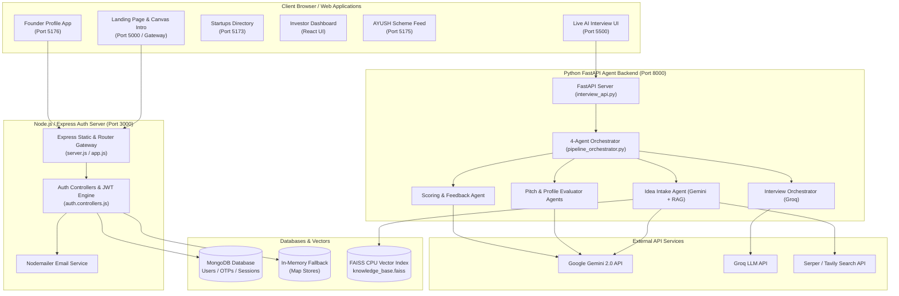

# Startup-AYUSH Portal 🌿🚀
### Smart India Hackathon (SIH 2026) | Problem Statement: SIH1345

> **An AI-powered evaluation pipeline, real-time adaptive interview engine, and investor matching ecosystem for AYUSH (Ayurveda, Yoga & Naturopathy, Unani, Siddha, Homeopathy) startups.**

---

## 📌 Overview

The **Startup-AYUSH Portal** addresses key bottlenecks in the Indian AYUSH entrepreneurship ecosystem:
- **For Founders:** Complex pitch deck submission process, lack of instant objective feedback, and difficulty accessing relevant Ministry of AYUSH schemes.
- **For Investors & Incubators:** Time-consuming deck screening, inability to quickly verify domain credibility, and lack of risk metrics for early-stage ventures.
- **For Government Administrators:** Manual evaluation burden and difficulty routing high-potential ventures to capital vs. mentoring.

This project delivers a **full-stack unified platform** featuring an automated **4-Agent LLM & RAG Pitch Evaluation Engine**, a **Real-Time Interactive AI Interviewer**, an **Offline-Resilient Express + MongoDB Auth Gateway**, and **5 specialized React & Web sub-applications**.

---

## ✨ Key Features

### 🤖 1. Multi-Agent AI Pitch Evaluation Pipeline (4-Stage Architecture)
- **Stage 1: Idea Intake Agent (`idea_intake_agent.py`)**
  - Parses uploaded PDF/PPT pitch decks using Google Gemini 2.0 Multimodal API.
  - Queries a local **FAISS CPU Vector Store** (`knowledge_base.faiss`) for market benchmarking.
  - Falls back to live web search (`Serper.dev` / `Tavily`) to discover external market competitors.
- **Stage 2: Live AI Interview Orchestrator (`interview_orchestrator_agent.py`)**
  - Conducts a 5-question adaptive interview powered by low-latency **Groq LLM** (`mixtral-8x7b` / `llama3-70b`).
  - Formulates targeted follow-up questions based on deck gaps and founder answers.
  - Generates category-tagged split transcripts (`transcript_idea_qa` & `transcript_profile_qa`).
- **Stage 3A & 3B: Pitch & Profile Evaluator Agents**
  - **Pitch Evaluator Agent (`pitch_evaluator_agent.py`):** Evaluates problem clarity, market size, business model, traction, and ask (raw score /50).
  - **Profile Evaluator Agent (`profile_evaluator_agent.py`):** Evaluates founder domain expertise, technical capacity, and team completeness (raw score /40).
- **Stage 4: Scoring & Feedback Agent (`scoring_feedback_agent.py`)**
  - Normalizes pitch score to **19.5 points** and profile score to **10.5 points** (Total Score out of **30.0**).
  - Automatically routes startups:
    - $\text{Score} \ge 18.0 \rightarrow \mathbf{\text{investor\_visible}}$ (Displayed on Investor Deal Flow)
    - $\text{Score} < 18.0 \rightarrow \mathbf{\text{mentor\_routed}}$ (Routed to Incubator Guidance)
  - Synthesizes LLM feedback reports detailing strengths, areas to improve, and executive summaries.

### 🔒 2. Authentication & Session Gateway
- **Dual-Mode Backend Engine:** Features an automatic database failover (`isDbConnected()`). Uses **MongoDB via Mongoose** when connected; gracefully falls back to **In-Memory ES6 Maps** when offline for seamless hackathon demos.
- **Two-Factor Email OTP:** Generates cryptographically secure 6-digit OTPs, stores SHA-256 hashes, and delivers emails via **Nodemailer SMTP**.
- **JWT & Cookie Security:** Issues short-lived Access Tokens (15 min) and HTTP-Only, `SameSite=Strict` Refresh Cookies (3 days) with session revocation logic (`logout` / `logout-all`).

### 🎨 3. Multi-Module Web Frontends
- **Mandala Canvas Intro (`Frontend/starting page`):** 202-frame 24fps WebP animation with smooth cubic-bezier fade-to-white handoff.
- **Main Home Portal (`Frontend/Home_Page`):** Overview dashboard and navigation gateway.
- **Startups Directory (`Frontend/Startups`):** Vite + React application with 15+ rich components (Filters, Comparison, AI Recommendations, Interactive Map).
- **Investor Dashboard (`Frontend/investor`):** Deal flow portal with risk scorecards, deal stages, and founder metrics.
- **Founder Profile Manager (`Frontend/profile`):** Verification status, pitch readiness tracker, and company metrics workspace.
- **AYUSH Scheme Feed (`Frontend/schemes`):** Government schemes discovery engine with eligibility checkers.

---

## 🏛️ System Architecture



---

## 🛠️ Tech Stack

| Domain | Technologies Used |
| :--- | :--- |
| **Frontend** | React 18, Vite 5, Tailwind CSS 3, HTML5 Canvas, JavaScript (ES6+), Lucide Icons, Framer Motion |
| **Auth & Gateway** | Node.js, Express 5, Mongoose 9, MongoDB, JWT (JsonWebToken), Bcrypt, Cookie-Parser, Nodemailer |
| **AI & ML Pipeline** | Python 3.10+, FastAPI, Uvicorn, Google Gemini API (`google-genai`), Groq API, FAISS CPU (`faiss-cpu`), NumPy |
| **RAG & Search** | FAISS Vector Store (`IndexFlatL2`), Serper.dev API, Tavily API |
| **Tooling & Orchestration** | Concurrently, Nodemon, PostCSS, Autoprefixer |

---

## 📁 Repository Structure

```
SIH-hackthon-INTERNAL-/
├── package.json                   # Master dev runner (concurrently)
├── PROJECT_CONTEXT.md             # Complete AI-Context Architectural Document
├── README.md                      # Project documentation (this file)
│
├── Agent/                         # Python AI Agent Ecosystem & FastAPI Server
│   ├── interview_api.py           # FastAPI backend serving interview & evaluation endpoints
│   ├── pipeline_orchestrator.py   # End-to-end 4-agent pipeline runner
│   ├── idea_intake_agent.py       # Stage 1: Multimodal pitch deck parser & RAG checker
│   ├── interview_orchestrator_agent.py # Stage 2: Adaptive AI interviewer (Groq)
│   ├── pitch_evaluator_agent.py   # Stage 3A: Pitch & strategy evaluator (Gemini)
│   ├── profile_evaluator_agent.py # Stage 3B: Founder & team evaluator (Gemini)
│   ├── scoring_feedback_agent.py # Stage 4: Score normalization (/30), routing & feedback report
│   ├── seed_kb.py                 # Vector DB builder script
│   ├── knowledge_base.faiss       # Pre-indexed FAISS CPU vector knowledge base
│   ├── interview_dashboard.html   # Standalone web interface for live AI interviews
│   └── requirements.txt           # Python dependencies
│
├── Authentication/                # Node.js + Express Authentication Service
│   ├── server.js                  # Express HTTP server entry point (Port 3000)
│   ├── package.json               # Auth service dependencies
│   ├── public/                    # Auth UI pages & CSS assets
│   └── src/
│       ├── app.js                 # Express app configuration & static gateway routes
│       ├── config/                # Database & environment configurations
│       ├── controllers/           # Auth, pitch, and evaluation controllers
│       ├── middlewares/           # JWT authentication middleware (auth.middleware.js)
│       ├── models/                # User, OTP, Session, Pitch, and Evaluation Mongoose schemas
│       ├── routes/                # Auth (/api/auth), Pitch (/api/pitches), and Evaluation (/api/ai/evaluations) routes
│       └── service/               # Nodemailer SMTP email service
│
└── Frontend/                      # Multi-Module Frontend Applications
    ├── package.json               # Concurrent sub-application dev runner
    ├── starting page/             # Root Landing Page & 202-frame Canvas Intro Animation
    ├── Home_Page/                 # Main Portal Overview & Navigation Gateway
    ├── Startups/                  # Vite + React Startups Discovery Directory (Port 5173)
    ├── investor/                  # Vite + React Investor Deal Flow Dashboard
    ├── profile/                   # Vite + React Founder Profile App (Port 5176)
    └── schemes/                   # Vite + React Government Schemes Feed (Port 5175)
```

---

## ⚡ Quick Start Guide

### Prerequisites
- **Node.js:** v18.0.0 or higher
- **Python:** v3.10 or higher
- **MongoDB:** (Optional) Local MongoDB instance or MongoDB Atlas URI. *If offline, the server automatically uses in-memory storage.*

### 1. Clone & Install Dependencies

```bash
# Clone the repository
git clone https://github.com/Anu7276/SIH-hackthon-INTERNAL-.git
cd SIH-hackthon-INTERNAL-

# Install root dependencies
npm install

# Install Authentication backend dependencies
cd Authentication && npm install && cd ..

# Install Frontend dependencies
cd Frontend && npm install
cd Startups && npm install && cd ..
cd profile && npm install && cd ..
cd schemes && npm install && cd ..
cd investor && npm install && cd ../..

# Install Python Agent dependencies
cd Agent
pip install -r requirements.txt --break-system-packages
cd ..
```

### 2. Environment Variables Setup

#### Create `Agent/.env`:
```env
GEMINI_API_KEY=your_google_gemini_api_key
GROQ_API_KEY=your_groq_api_key
SERPER_API_KEY=your_serper_dev_api_key    # Optional
TAVILY_API_KEY=your_tavily_api_key        # Optional
```

#### Create `Authentication/.env`:
```env
PORT=3000
MONGO_URI=mongodb://127.0.0.1:27017/ayush_auth   # Optional
JWT_SECRET=your_super_secret_jwt_key
EMAIL_USER=your_email@gmail.com
EMAIL_PASS=your_email_app_password
```

---

## 🚀 Running the Application

### Option A: Master Command (Runs All Services Concurrently)
Run the entire platform (Auth Backend, FastAPI Agent Server, Python Dashboard Server, and Frontend apps) with a single command:

```bash
npm run dev
```

### Services Launched:
| Service | Technology | Port / URL |
| :--- | :--- | :--- |
| **Express Gateway & Auth** | Node.js + Express | `http://localhost:3000` |
| **Landing & Intro Page** | HTML5 Canvas / Serve | `http://localhost:5000` |
| **Startups Directory** | Vite + React | `http://localhost:5173` |
| **Investor Dashboard** | Vite + React | `http://localhost:5174` |
| **AYUSH Schemes Feed** | Vite + React | `http://localhost:5175` |
| **Founder Profile App** | Vite + React | `http://localhost:5176` |
| **FastAPI Agent API** | Python Uvicorn | `http://localhost:8000` |
| **AI Interview Dashboard** | HTTP Server / HTML | `http://localhost:5500/interview_dashboard.html` |

---

## 📡 API Reference

### Authentication Endpoints (`http://localhost:3000/api/auth`)

| Method | Endpoint | Description | Auth Required |
| :--- | :--- | :--- | :--- |
| `POST` | `/register` | Register user & send 6-digit OTP email | No |
| `POST` | `/verify-email` | Verify email with 6-digit OTP code & issue session token | No |
| `POST` | `/login` | Authenticate user & issue Access/Refresh tokens | No |
| `GET` | `/get-me` | Get active user profile from Bearer token | Yes (Bearer) |
| `GET` | `/refresh-token` | Rotate refresh cookie & issue new access token | Cookie |
| `GET` | `/logout` | Invalidate current device session | Cookie |
| `GET` | `/logout-all` | Revoke sessions on all devices | Cookie |

### Pitch & Evaluation Endpoints (`http://localhost:3000/api`)

| Method | Endpoint | Description | Auth Required |
| :--- | :--- | :--- | :--- |
| `POST` | `/api/pitches` | Create new pitch deck record (`status: pending`) | Yes (Bearer) |
| `GET` | `/api/pitches/:pitchId` | Retrieve pitch status and metadata | Yes (Bearer) |
| `POST` | `/api/ai/evaluations` | Persist 4-agent evaluation result & enforce backend routing | Yes (Bearer) |

### AI Agent Endpoints (`http://localhost:8000/api`)

| Method | Endpoint | Description |
| :--- | :--- | :--- |
| `POST` | `/idea/upload` | Upload PDF/PPT pitch deck & run Stage 1 RAG extraction |
| `POST` | `/interview/start` | Initialize Stage 2 live AI interview session |
| `POST` | `/interview/answer` | Submit founder answer & receive adaptive follow-up question |
| `GET` | `/interview/result/{id}` | Fetch split transcripts (`transcript_idea_qa` & `transcript_profile_qa`) |
| `POST` | `/interview/evaluate/{id}` | Execute 4-agent evaluation pipeline and return normalized score /30 |
| `GET` | `/health` | Server status check and active session counters |

---

## 🧮 Evaluation Math & Routing Thresholds

$$\text{Pitch Subtotal Normalization} = \left(\frac{\text{Pitch Raw Score}}{50}\right) \times 19.5$$

$$\text{Profile Subtotal Normalization} = \left(\frac{\text{Profile Raw Score}}{40}\right) \times 10.5$$

$$\mathbf{\text{Total Final Score}} = \text{Pitch Component} + \text{Profile Component} \quad (\text{Maximum } 30.0)$$

$$\text{Routing Decision} = \begin{cases} \mathbf{\text{investor\_visible}}, & \text{if Total Score} \ge 18.0 \\ \mathbf{\text{mentor\_routed}}, & \text{if Total Score} < 18.0 \end{cases}$$

---

## 📄 Documentation

For full architectural details, data models, security breakdowns, and comprehensive file mappings, refer to [PROJECT_CONTEXT.md](file:///c:/Users/anura/OneDrive/Desktop/SIH/SIH-hackthon-INTERNAL-/PROJECT_CONTEXT.md).

---

## 🤝 Contributing & License

Developed for **Smart India Hackathon (SIH 2026)** under Problem Statement **SIH1345**.  
Distributed under the ISC License.
